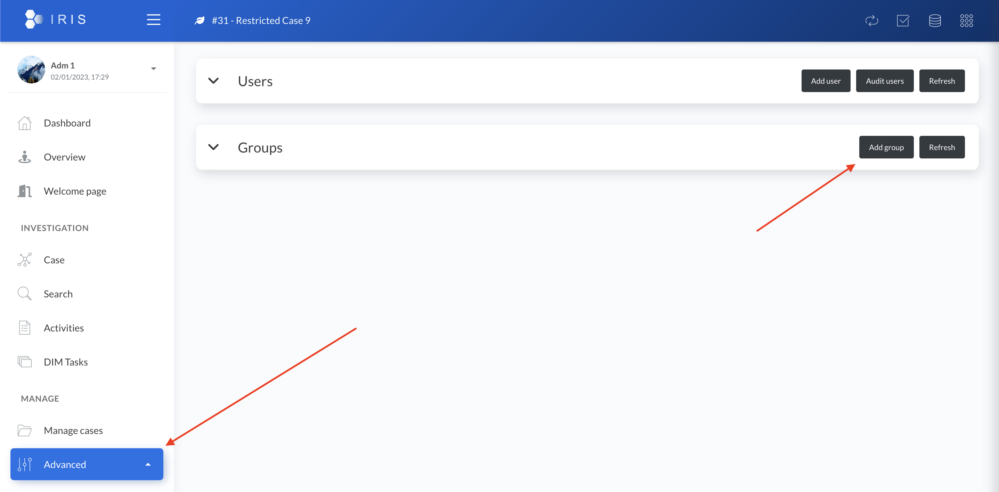
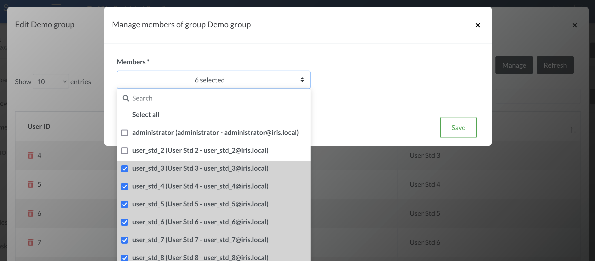
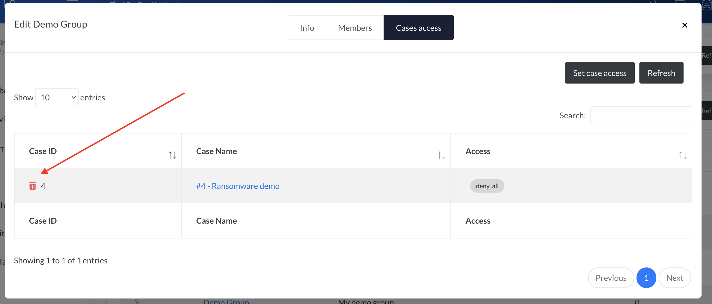
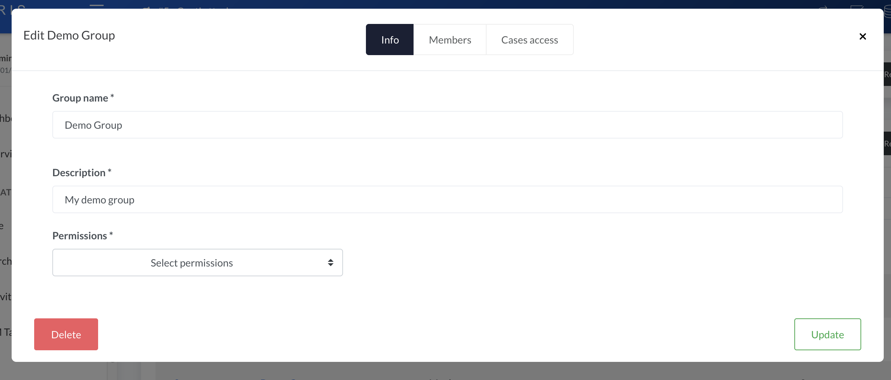

# Groups

Groups offer the possibility to set case access as well as permissions.  
By default two groups are created: 

- `Administrator`: users in this group hold the `server_administrator` permission, 
- `Analysts`: users in this group hold the `standard_user` permission 

Both groups are set to give full cases access to the users.  

## Setting up a new group 
Head to the Access Control page and click `Add group`. 

Fill the form. All the fields can be changed later on. The field `Group name` has to be unique on the IRIS instance.  
Access control and members can be set once the group is created.   

## Configuring the group
The group can be configured once created by clicking on it in the list.  

### Users 

#### Adding users to a group
To add users to the group, go to the `Members` tab and click `Manage`.

The `User Manager` should load and offers a list of users that can be added to the group. Select all the users you want to add to the group and press `Save`. 

 

!!! info "Permissions computation"
    When a user is added/removed to a group, its effective cases access are recomputed. Depending on the number of cases and users added/removed this can take some time. 
    This process helps reducing the DB load when using IRIS during normal operation. 

#### Removing users from a group
To remove users from the group, go to the `Members` tab and click `Manage`. 

The `User Manager` should load and present a list of both users already in the group as well as the ones that can be added. To remove one or more users, un-tick them from the list and press `Save`. 

Alternatively, a user can be directly removed from within the group manager. Click on the red trash next to the user to remove and confirm the deletion. 

### Cases
#### Adding cases to the group 
Access to one or multiple existing cases can be granted to a group. From within the `Group Manager`, go to the `Cases Access` tab and click `Set case access`.  

The `Cases Access Manager` loads and gives the possibility to set the access to one or more cases.  

Three choices of access are offered: 

 - `deny_all`: No access at all to the case. The users won't even see the case listed, 
 - `read_only`: Read-only access to the case. The users can see everything related to the case(s) but cannot change anything,
 - `full_access`: Read-Write access to the case. The users can see and change everything related to the case. 

Once the desired access is selected, press `Set access`.  

!!! info "Permissions computation"
    As for the addition of users, when a case is added/removed to a group, all the users' effective cases access are recomputed. Depending on the amount of cases added/removed and number of users this can take some time. 
    This process helps reducing the DB load when using IRIS during normal operation. 

#### Removing cases from the group 
From within the `Group Manager`, go to the `Cases Access` tab. Click on the red trash next to the case to remove and confirm the deletion.

## Removing a group
A group can be deleted by clicking on its name in the list and then `Delete` at the bottom of the `Info` tab.  

