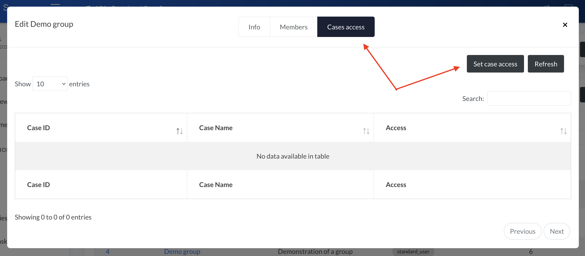

# Organisations

## Security boundaries
Organisations provide a security boundary on IRIS.  

 - Users in organisation A cannot see the users of organisation B apart from the users they share, 
 - Cases creates in organisation A cannot be seen by users of organisation B apart from the cases they share,
 - **Users with permission `manage_organisations` can see all users, cases and organisations whatever the organisations they belong to** 

```mermaid
sequenceDiagram
    OrganisationA--xOrganisationB: Cannot see B users
    OrganisationB--xOrganisationA: Cannot see A users
    Note over OrganisationA,OrganisationB: Except shared users
    
    OrganisationA--xOrganisationB: Cannot see B cases 
    OrganisationB--xOrganisationA: Cannot see A cases
    Note over OrganisationA,OrganisationB: Except shared cases
```

## Setting up a new organisation 
A user account with `manage_organisations` or `manage_own_organisations` permissions. 

Head to the Access Control page and click `Add organisation`. 

Fill the form. Only the two first fields are mandatory. They both can be changed later on. The field `Organisation name` has to be unique on the IRIS instance. 

## Configuring an organisation
A user account with `manage_organisations` or `manage_own_organisations` permissions.  
Organisations can be configured once created by clicking on it in the list.  

### Users 

#### Adding users to an organisation
To add users to the organisation, go to the `Members` tab and click `Manage`.

The users manager should load and offers a list of users that can be added to the organisation. Select all the users you want to add to the organisation and press save. 

!!! warning "Important note"
    Users with permission `manage_organisations` will see all users on IRIS, no matter the organisation membership.  
    Users with permission `manage_own_organisation` will only see the users belonging to their own organisations.  

!!! info "Permissions computation"
    When a user is added/removed to an organisation, its effective cases access are recomputed. Depending on the amount of cases and users added/removed this can take some time. 
    This process helps reducing the DB load when using IRIS during normal operation. 

#### Removing users from an organisation
To remove users from the organisation, go to the `members` tab and click `Manage`. 

The users manager should load and present a list of both users already in the organisation as well as the ones that can be added. To remove one or more users, un-tick them from the list and press `Save`. 

Alternatively, a user can be directly removed from withing the organisation manager. Click on the orange minus next to the user to remove and confirm the deletion. 

### Cases
#### Adding cases to the organisation 
Access to one or multiple existing cases can be granted to an organisation. From within the `organisation manager`, go to the `Cases access` tab and click `Set case access`.  

The `cases access manager` loads and gives the possibility to set the access to one or more cases.  

Three choices of access are offered: 

 - `deny_all`: No access at all to the case. The users won't even see the case listed, 
 - `read_only`: Read-only access to the case. The users can see everything related to the case(s) but cannot change anything,
 - `full_access`: Read-Write access to the case. The users can see and change everything related to the case. **They cannot close it or delete it unless they are granted the `manage_cases` permission.**. 

Once the desired access is selected, press `Set access`.  

!!! info "Permissions computation"
    As for the addition of users, when a case is added/removed to an organisation, all the users effective cases access are recomputed. Depending on the amount of cases added/removed and number of users this can take some time. 
    This process helps reducing the DB load when using IRIS during normal operation. 

#### Removing cases from the organisation 
From within the `organisation manager`, go to the `Cases access` tab. Click on the orange minus next to the case to remove and confirm the deletion.

