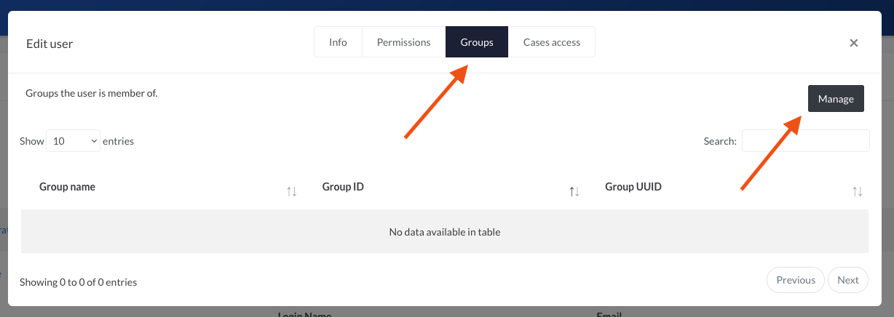
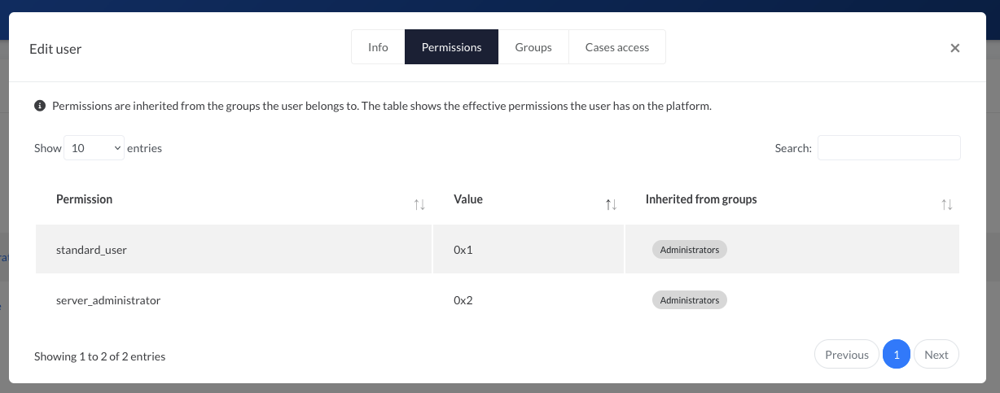
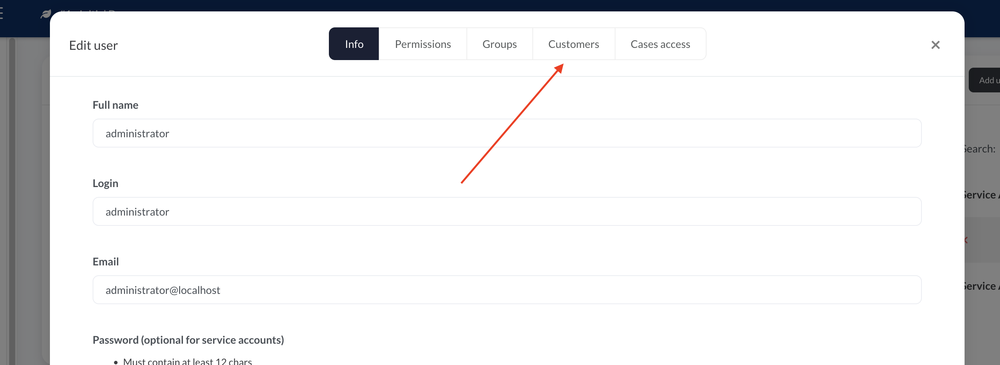
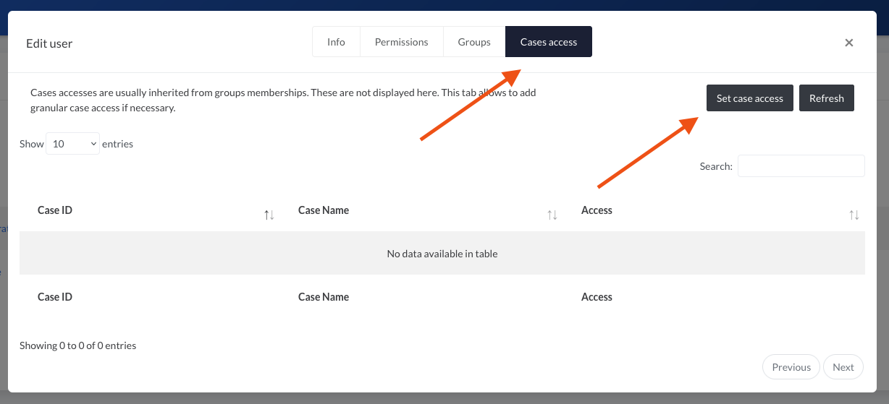
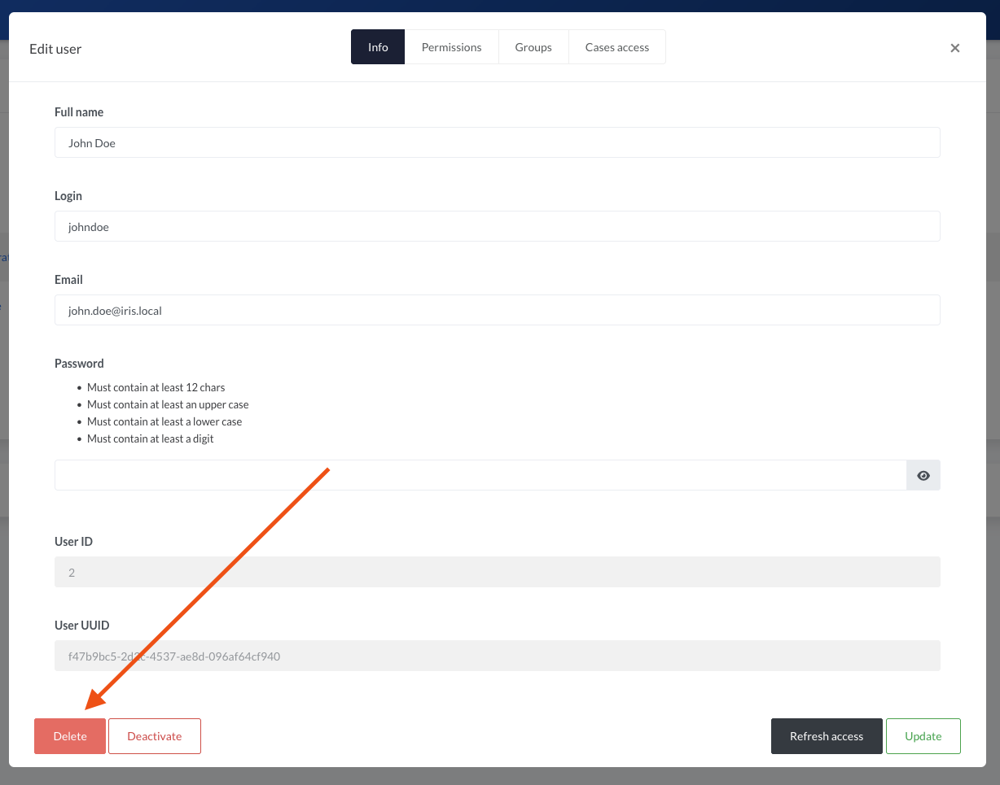

# Users

!!! tip "Authentication"
    Looking for authentication settings? [It's here](authentication.md)

**Whatever the authentication mechanism used (Local or LDAP), the users have to be declared in IRIS.** This is done in `Advanced` > `Access Control` > `Users`. 

## Adding a user 
Head to `Advanced` > `Access Control` > `Users` and click `Add user`.  
All fields of the form are required. All information can be changed after the creation.   

!!! tip "Note" 
    Permissions and groups can be set once the user is created.   

- **Full Name** : Name of the user to add 
- **Login** : Username used to login in IRIS. Has to be unique on the instance 
- **Email** : Email of the user to add. Has to be unique on the instance  
- **Password**: Password respecting the policy defined in `Advanced` > `Server settings`. The password also has to be set when using LDAP, it is then however not used for the authentication. A random password can be set when using LDAP. No password is required when the user is set as a service account.  
- **Is service account** : If the user is a server account, check this box. Server accounts are used to connect to the API. They cannot login to the UI. 

!!! Warning "Service accounts"
    Service accounts users can use the API to perform any actions on the instance. They cannot login to the UI and they don't have a password.

 

## Editing a user 
A user can be edited by clicking on its name or ID in `Advanced` > `Access Control` > `Users`.  A window opens and display the user's information. Tabs at the top allow to configure multiple settings related to the user.   

## Setting permissions
Permissions of a user cannot be set directly. They are inherited from the groups membership. The tab `Permissions` only displays the permissions the user has from its groups memberships. 
See [Groups](groups.md) for more info.   

## Setting groups 
Groups can be set by clicking on the `Groups` tab of the user's window and then `Manage`.      

 

A new window appears with the possibility to select the groups the user should belong to. 
 

After saving, the permissions of the user are updated. This can be verified in the `Permissions` tab.   
 

## Setting customers
Customers can be set by clicking on the `Customers` tab of the user's window and then `Manage`.

 

A new window appears with the possibility to select the customers the user should belong to. 

## Setting cases access 
Cases access are usually set through groups membership. However for granularity they can be set per user.   
To set the access of a user on a case, click on the `Cases access` tab of the user's window and then `Set case access`.   

 

As for the Groups, a selector appears and allows to select one or multiple cases and the access to associate.       
 

!!! info 
    Application of a case access is immediate, even if the user is logged in and browsing the case.  

!!! info 
    Granular case access can also be set from a case itself, in `Summary` > `Manage` > `Access`.  

## Deactivating a user
A user can be deactivated, which has the following impact: 

- User cannot login anymore 
- User cannot use its API key anymore 
- User is not proposed in tasks assignees anymore 

 

## Deleting a user 
It is usually not possible to delete a user. This is to keep consistency in the database. A user can be deleted if it has done absolutely no actions on the platform. If a user leaves the organisation, it is recommended to rename the user and deactivate it.  

 

## Setting customers
Customers can be set by clicking on the `Customers` tab of the user's window and then `Manage`. 