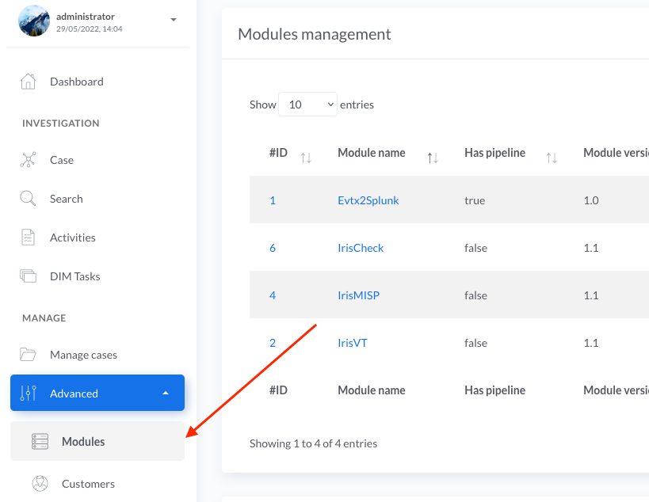

# Introduction

!!! tip "*New types of modules are introduced in IRIS v1.4.0*"

IRIS can be extended with modules. They can be split in two types:   

- Pipeline modules : Allow upload and process of evidences through modular pipelines (eg: EVTX parsing and injection into a database or data visualiser)
- Processor modules : Allow processing of IRIS data upon predefined actions / hooks. (eg: be notified when a new IOC is created and get VT/MISP insights for it).

Modules (or DIM - DFIR-IRIS Modules) are actually Python packages which must be installed in the Python environment of iris-webapp and the worker (see Quick Start).
Once installed in the Python environment, modules can be managed in ``Advanced`` > ``Modules``.

!!! info
    This section is only available for users with the Admin role.

By default IRIS is shipped with multiple modules.  

- [IrisVTModule](natives/IrisVT.md)  : Processor module offering VirusTotal insights (installed and registered)
- [IrisMispModule](natives/IrisMISP.md)  : Processor module offering MISP insights (installed and registered)
- [IrisWebHooksModule](natives/IrisWebHooks.md)  : Processor module offering webhooks support (manual installation)
- IrisCheckModule : A basic processor module logging every hooks. Used to check the good functionning. (installed and registered) 
- IrisEVTXModule : A pipeline module offers EVTX import into Splunk through IRIS (installed but not registered) 