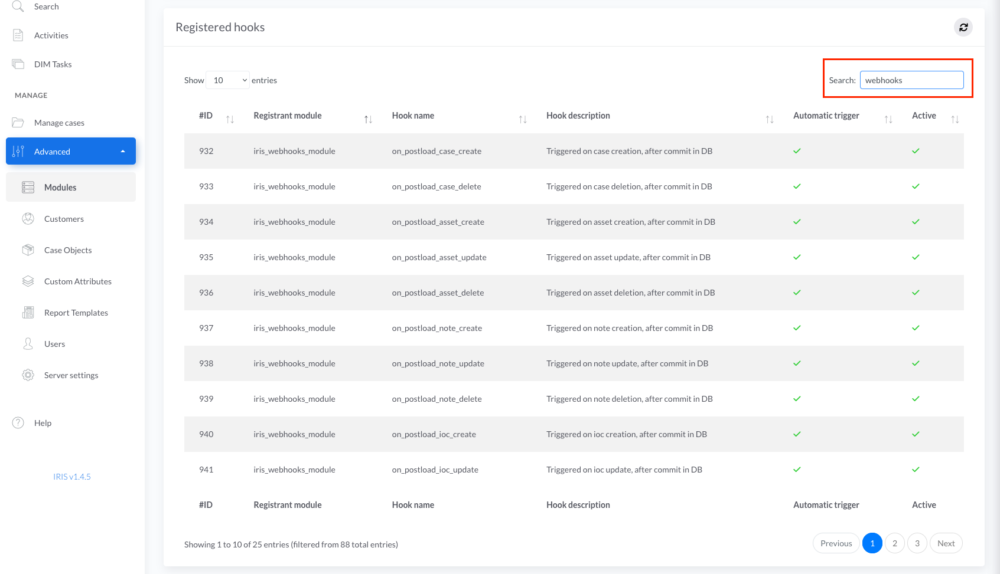

# Module IRIS Webhooks


This module offers webhooks support for IRIS. It can be configured to send almost any events to to an external service supporting webhooks, such as Discord, Slack or Microsoft Teams. It can also be used with automation tools such as Tines and Shufle to further automate IRIS.  
The source code is available [here](https://github.com/dfir-iris/iris-webhooks-module). 

## Features 

- Support multiple webhooks receivers thanks to its configurable payload 
- Support multiple webhooks receivers at the same time 
- Allows to send one, multiple or all events to an external service 

**Slack Example**  


## Configuration 
The expected configuration is a JSON file, following the structure.  

!!! info 
    Do not copy as-is the configuration below. The comments are not valid in JSON and the configuration will be rejected. 

``` json
{   
    // Base URL of IRIS. This is used to set the links in the messages
    "instance_url": "<IRIS_INSTANCE_URL>",

    // A list descrbing each webhook as a dict
    "webhooks": [
        {
            // An internal name - it's never used outside of this configuration file 
            "name": "Name of the webhook for internal reference only",

            // Set true or false to disable the webhook
            "active": true,

            // A list of the webhooks to listen to. See below for the list of hooks. 
            "trigger_on": ['on_postload_alert_create'],

            // The URL of the webhook. This is the URL the module will do a POST request to. 
            "request_url": "<URL OF THE WEBHOOK>",

            // Use a predefined rendering. The rendering cannot be changed. For more flexibility, set this value to false. 
            // If set to true, `request_rendering` should be set with one of the values described after.  
            "use_rendering": true,

            // Set to 'none' if use_rendering is disabled. 
            // Otherwise set to one of the following value            
            // - markdown 
            // - markdown_slack
            // - html
            "request_rendering": "none", 

            // The body to be POST-ed by the webhook request URL 
            // See below for more information on the formatting.
            "request_body": {
                "alert_title": "[ALERT] ${{alerts.alert_title}}",
                "alert_description": "${{alerts.alert_description}}"
            }
        },
        {
            "name": "Another hook",
            "active": true,
            "use_rendering": false,
            "trigger_on": ["on_postload_ioc_update"],
            "request_url": "<URL OF THE WEBHOOK 2>",
            "request_rendering": "none", 
            "request_body": {
                "iocs": "iocs"
            }
        }
    ]
}
```

The `trigger_on` expects one or more of the following [IRIS hooks](https://docs.dfir-iris.org/development/hooks/#available-hooks). To enable a set of hooks without writing them all, the following keywords can be used : 

- `all`: Includes all `on_postload` hooks 
- `all_create`: Includes all `on_postload_XX_create` hooks
- `all_update`: Includes all `on_postload_XX_update` hooks

### Body configuration 
The body contains the data to be sent in a POST request. **It has to be a valid JSON.**   

#### Rendering
If `use_rendering` is enabled, then only two markups can be used to set the content of the webhook.

- `%TITLE%`: replaced with name of the case and event title, e.g "[#54 - Ransomware] IOC created". The title cannot be changed.  
- `%DESCRIPTION%`: Description of the event, e.g "UserX created IOC mimi.exe in case #54". The description message is internal and cannot be changed. The message varies depending on the object which triggered the hook.  

These markups can be placed in any values of the JSON body. As a webhook is triggered, they will be replaced by the module before the request is sent.  

#### Raw body
For more flexibility, one can use raw rendering by setting `use_rendering` to false. In such case, a raw JSON representation of the object related to the hook is available.   
Each JSON depends on the hook. For instance for hooks related to `IOCs`, the available JSON is an object representing the IOC. For cases, a JSON object representing the case.  In most of the cases, these JOSN object matches what is documented in the API.    

Either the whole object, specific fields, or both can be selected. If a field is selected, it needs to be wrapped  `${{ object }}`. For examples, the following body is a valid one:  

```
{
    "alert_title": "[New alert] ${{alerts.alert_title}}",
    "alert_description": "${{alerts.alert_description}}",
    "alert_meta": "A unrelated field wit static data",
    "alert_dates": {
        "creation_date": "${{ alerts.alert_creation_date }}",
        "update_date": "${{ alerts.alert_update }}"
    }, 
    "alert_raw": "alerts"
}
```

The value of the field `alert_raw`, will be automatically replaced by the raw value of the alerts.   


!!! note 
    When using `${{}}` the value is treated as a string. Thus objects will be flatened. 


### Checking IRIS hooks registration
Each time a webhook is added, the module subscribes to the specified hooks. After saving the configuration, one can check the registration was successful by filtering the `Registered hooks table` (don't forget to refresh the table).  




## Troubleshooting 

Webhooks receivers are expecting specific message formatting to successfully process them. Please carefully read their documentations.   

The module only handles JSON POST for the moment. If the target webhook receiver needs another type of request, please contact us so we can add it.  

As any IRIS module, IrisWebhooks is logged into DIM Tasks. You can check the status of the requests made in these. Go to `DIM Tasks` and then filter with `webhooks`. You can then check details info by clicking in the Task ID. More info might be available in the Docker worker logs depending on the situation. 


## Important Notes and know issues

- For a complete experience, some features are missing on the server side - such as case info and user info passed to modules. For instance, IOC events do not hold case info, assets update events do not hold the user info who made the change.  