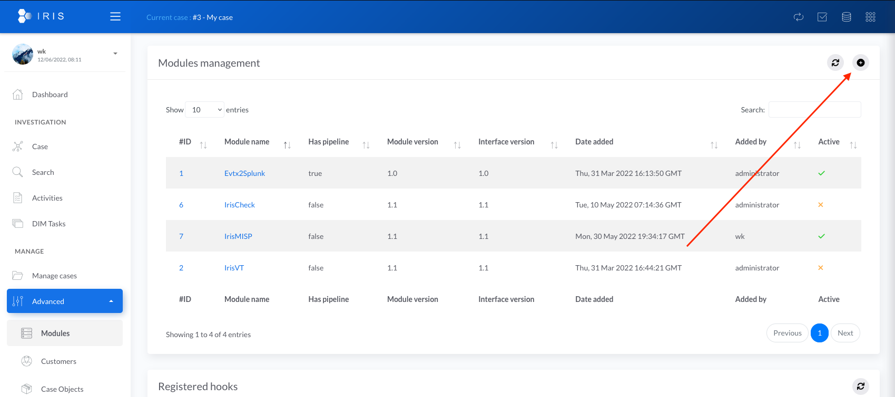
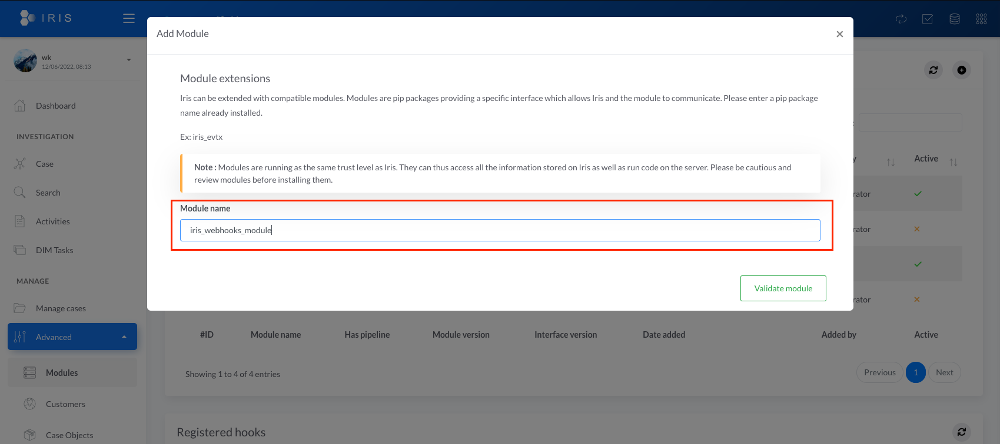

# Module IRIS Webhooks

!!! tip "Note"
    This module is not yet bundled with IRIS and is in beta. It will be included in next versions of IRIS but can already be installed manually. 


This module offers webhooks support for IRIS. It can be configured to send almost any events to to an external service supporting webhooks, such as Discord, Slack or Microsoft Teams. 
The source code is available [here](https://github.com/dfir-iris/iris-webhooks-module). 

## Features 

- Support multiple webhooks receivers thanks to its configurable payload 
- Support multiple webhooks receivers at the same time 
- Allows to send one, multiple or all events to an external service 

**Slack Example**  


## Installation 

!!! check "Requires IRIS >= 1.4.0"

### Online
The module is published on Pypi and can be directly installed through pip on the app docker container.  

```bash title="Install the pip package on the dockers"
# Install on IrisWebApp
docker exec -ti <iris_app_instance> /bin/bash
pip3 install iris-webhooks-module

# Install on the worker
docker exec -ti <iris_worker_instance> /bin/bash
pip3 install iris-webhooks-module
```

Then [register the module](#register-the-module-in-iris). 

### Offline
If your server is not connected to internet, you can still do an offline install. 

1. Download the wheel from Pypi : [https://pypi.org/project/iris-webhooks-module/#files](https://pypi.org/project/iris-webhooks-module/#files)
2. Copy the wheel to the Iris Web App docker : `docker cp iris_webhooks_module-XXXX-py3-none-any.whl <iris_app_instance>:/iriswebapp/dependencies/` 
3. Install the module 
```bash
docker exec -ti <iris_app_instance> /bin/bash   
pip3 install ./iriswebapp/dependencies/iris_webhooks_module-XXXX-py3-none-any.whl
```
4. Do the same for the worker 

Then [register the module](#register-the-module-in-iris). 

### Register the module in IRIS
Then go to the modules management in `Advanced > Modules`. Click on the `+` on the top right.   



In `Module name`, input `iris_webhooks_module` and validate. 



The module should be imported and can now be configured. 

## Configuration 
The expected configuration is a JSON file, following the structure : 

``` json
{   
    "instance_url": "<IRIS_INSTANCE_URL>",
    "webhooks": [
        {
            "name": "Name of the webhook for internal reference only",
            "active": false,
            "trigger_on": [<LIST OF HOOKS TO LISTEN TO>],
            "request_url": "<URL OF THE WEBHOOK>",
            "request_rendering": "<RENDERING TYPE OF THE MESSAGE>", 
            "request_body": {<BODY OF THE REQUET TO SEND>}
        },
        {
            "name": "Another hook",
            "active": false,
            "trigger_on": [<LIST OF HOOKS TO LISTEN TO>],
            "request_url": "<URL OF THE WEBHOOK 2>",
            "request_rendering": "<RENDERING TYPE OF THE MESSAGE>", 
            "request_body": {<BODY OF THE REQUEST TO SEND 2>}
        }
    ]
}
```

- `instance_url`: Base URL of IRIS. This is used to set the links in the messages
- `webhooks`: A list of JSON describing the webhooks 
For each webhook:
    - `name`: Internal name of the webhook, this can be anything 
    - `active`: Optional - Set to false to disable the webhook 
    - `trigger_on`: List of [IRIS hooks](https://docs.dfir-iris.org/development/hooks/#available-hooks) for which the webhook should be triggered. Only the `on_postload_XX` hooks are supported. To enable a set of hooks without writing them all, the following keywords can be used : 
        - `all`: Includes all `on_postload` hooks 
        - `all_create`: Includes all `on_postload_XX_create` hooks
        - `all_update`: Includes all `on_postload_XX_update` hooks
    - `request_url`: The URL provided by the webhook receiver. For instance for Slack : [see how to get one](https://api.slack.com/messaging/webhooks#getting_started)
    - `request_rendering`: URLs rendering may be specific from one receiver to another. The modules supports the following : 
        - `markdown`: Format the message as markdown. This can be used with Discord for instance 
        - `markdown_slack`: Format the message as markdown, with some specificities of Slack. 
        - `html`: Format the message as HTML. 
    - `request_body`: The request body to be sent to the webhook receiver. Two markups can be used to set the content of the webhook. The request has to be in JSON format and is sent as-is after replacements of the markups. 
        - `%TITLE%`: Is replaced with name of the case and event title, e.g "[#54 - Ransomware] IOC created"
        - `%DESCRIPTION%`: Description of the event, e.g "UserX created IOC mimi.exe in case #54"

### Checking IRIS hooks registration
Each time a webhook is added, the module subscribes to the specified hooks. After saving the configuration, one can check the registration was successful by filtering the `Registered hooks table`. 


### Example

The following is an example of combined webhooks configuration. It can be directly imported in the module with the import feature. 
**Please note that after import, the configuration should be opened and change to match your URL webhook receiver.**

[Download webhooks combined configuration example](examples_config/IrisWebHooks_configuration_export.json) 

#### Discord
```json title="Discord webhook example - selection of events"
{   
    "instance_url": "https://iris.local",
    "webhooks": [
        {
            "name": "Discord",
            "trigger_on": [
                    "on_postload_ioc_create",
                    "on_postload_ioc_update",
                    "on_postload_note_create",
                    "on_postload_note_update"
                ],
            "request_url": "https://discord.com/api/webhooks/XXXX/XXXX",
            "request_rendering": "markdown", 
            "request_body": {
                "embeds": [{
                    "description" : "%DESCRIPTION%",
                    "title" : "%TITLE%"
                }]
            }
        }
    ]
}
```

#### Slack 
```json title="Slack webhook example - all events"
{   
    "instance_url": "https://iris.local",
    "webhooks": [
        {
            "name": "Slack",
            "trigger_on": [
                    "all"
                ],
            "request_url": "https://hooks.slack.com/services/<XXX>/<XXX>/<XXX>",
            "request_rendering": "markdown_slack",
            "request_body": {
                "text": "%TITLE%",
                "blocks": [
                	{
                		"type": "section",
                		"text": {
                			"type": "mrkdwn",
                			"text": "*%TITLE%*"
                		}
                	},
                	{
                		"type": "section",
                		"block_id": "section567",
                		"text": {
                			"type": "mrkdwn",
                			"text": "%DESCRIPTION%"
                		}
                	}
                ]
            }
        }
    ]
}
```

## Troubleshooting 

Webhooks receivers are expecting specific message formatting to successfully process them. Please carefully read their documentations.   

The module only handles JSON POST for the moment. If the target webhook receiver needs another type of request, please contact us so we can add it.  

As any IRIS module, IrisWebhooks is logged into DIM Tasks. You can check the status of the requests made in these. Go to `DIM Tasks` and then filter with `webhooks`. You can then check details info by clicking in the Task ID. More info might be available in the Docker worker logs depending on the situation. 


## Important Notes and know issues

- The module is in beta and will improve over time. More customization should be brought on the messages. 
- For a complete experience, some features are missing on the server side - such as case info and user info passed to modules. They will be added in the next release and this module will be updated. For instance, IOC events do not hold case info, assets update events do not hold the user info who made the change.  
- Deletions hooks are not working as expected in IRIS v1.4.5 and the module thus fails to notify upon objects deletions. This will be fix in the next release of IRIS.   